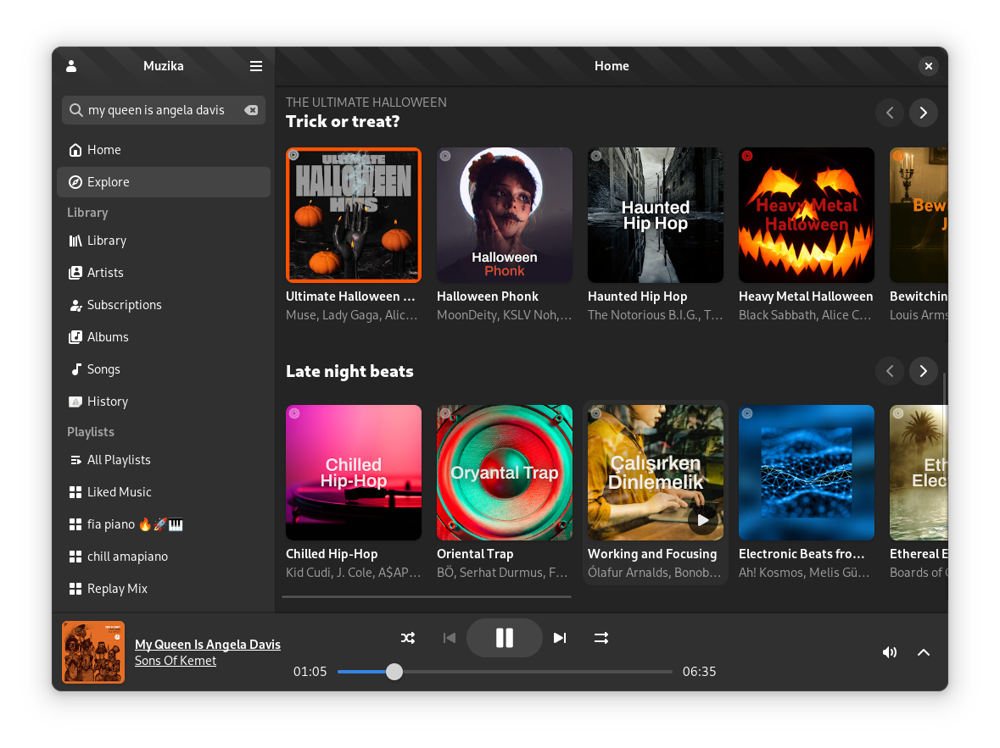
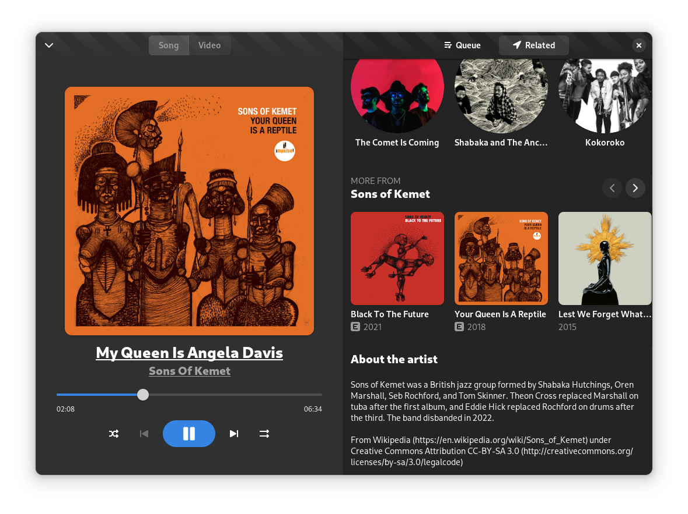

<p align="center">
  
</p>

<h1 align="center">🎵 AppStreamingMusic</h1>

<p align="center">
  <strong>Aplicación moderna de streaming musical con una interfaz elegante y minimalista.</strong>
</p>

<p align="center">
  Desarrollado por <b>Isai Reyes</b>
</p>

<p align="center">
  
  
  
  
</p>

---

# 📖 Descripción

**Muzika** es una aplicación de streaming de música creada para ofrecer una experiencia moderna, rápida y visualmente atractiva.  

La aplicación permite explorar canciones, álbumes, artistas y playlists desde una interfaz inspirada en plataformas musicales modernas.

---

# ✨ Características

- 🎧 Streaming de música en alta calidad
- 🔎 Búsqueda avanzada de canciones, artistas y álbumes
- 📻 Radios y mixes personalizados
- ❤️ Biblioteca musical personalizada
- 🎵 Visualización de letras de canciones
- 📀 Exploración de playlists y álbumes
- 🔐 Inicio de sesión con Google
- ⚡ Interfaz rápida y minimalista
- 🌙 Diseño moderno inspirado en GNOME y aplicaciones premium
- 🖥️ Compatibilidad multiplataforma

---

# 🖼️ Capturas de pantalla

## 🏠 Inicio



---

## 🎶 Reproducción



---

# 🛠️ Tecnologías utilizadas

<p align="center">


</p>

---

# 📥 Instalación

## 🔹 Descargar Flatpak

Puedes descargar la última versión Flatpak desde:

```bash
flatpak install muzika.flatpakref
```

## 🔹 Compilar desde el código fuente

Requisitos

- GNOME Builder
- GTK4
- libadwaita
- Meson
- Ninja

Clonar el repositorio
```
git clone https://github.com/isairey/AppStreamingMusic.git --recurse-submodules
```
## 🔹 Abrir el proyecto

Abre el proyecto en GNOME Builder y selecciona:
```
Build → Run
```
---

##🚀 Navegación interna

Muzika utiliza un sistema de navegación mediante URIs personalizadas.

- Ejemplos
- muzika:home
- muzika:library
- muzika:album:ID
- muzika:playlist:ID
- search:rock

---

# 📂 Estructura del proyecto
```
Muzika/
│
├── data/
├── src/
├── screenshots/
├── meson.build
├── package.json
└── README.md
```
---

# 📊 Roadmap

- Descarga de canciones offline
- Sincronización multiplataforma
- Ecualizador integrado
- Sistema de recomendaciones
- Temas personalizados
- Letras sincronizadas
- Aplicación móvil

 ---
 
# 🤝 Contribuciones

Las contribuciones son bienvenidas.

Si deseas mejorar el proyecto:

- Haz un Fork
- Crea una nueva rama
- git checkout -b feature/nueva-funcion
- Realiza tus cambios
- Haz commit
- git commit -m "Nueva funcionalidad"
- Haz push
- git push origin feature/nueva-funcion
- Abre un Pull Request

---

# 👨‍💻 Autor
<p align="center">  </p> <p align="center"> <b>Isai Reyes</b> </p> <p align="center"> Desarrollador Full Stack apasionado por la música, el diseño moderno y las aplicaciones multiplataforma. </p>

---

# 📜 Licencia

Este proyecto está bajo la licencia MIT.

